# CST8918 Final Project - Group 3

## Overview

This repository contains the final project for **CST8918 – DevOps: Infrastructure as Code**.

The objective of this project is to provision and manage the infrastructure required to deploy the Remix Weather Application on Microsoft Azure using Infrastructure as Code (Terraform). The solution includes Azure Kubernetes Service (AKS), Azure Container Registry (ACR), Azure Cache for Redis, Kubernetes, and GitHub Actions for CI/CD automation.

---

# Team Members

| Student | GitHub |
|----------|--------|
| Diniz Rodrigues Martins | [rodr0304](https://github.com/rodr0304) |
| Akash Patel | [Akash705-hub](https://github.com/Akash705-hub) |
| Divyang Lodariya | [Divyang2599](https://github.com/Divyang2599) |
| Harshdeep Puri | [harshdeep1230](https://github.com/harshdeep1230) |

---

# Task Assignment

| Team Member | Responsibilities | Status |
|-------------|------------------|--------|
| **Diniz Rodrigues Martins** | Repository setup, project structure, Terraform bootstrap module, network module, provider configuration, initial documentation (README), project integration support | ✅ Completed (initial setup) |
| **Akash Patel** | Terraform AKS module, create AKS clusters for Test and Production environments, validate Kubernetes connectivity | ✅ Completed |
| **Divyang Lodariya** | Terraform ACR module, Terraform Redis module, configure Azure Container Registry and Azure Cache for Redis for Test and Production | ✅ Completed |
| **Harshdeep Puri** | GitHub Actions workflows (Terraform Plan, Apply, Docker Build, Deployment), Kubernetes manifests, Remix Weather App deployment to AKS | ✅ Completed |

---

# Project Structure

```text
FinalProject-Group3
│
├── .github/
│   └── workflows/
│       ├── app-prod-deploy.yml
│       ├── app-test-deploy.yml
│       ├── tf-apply.yml
│       ├── tf-plan.yml
│       └── tf-static-analysis.yml
|── app/
│
├── infra/
│   ├── backend/
│   ├── environments/
│   │   ├── dev/
│   │   ├── test/
│   │   └── prod/
│   └── modules/
│       ├── acr/
│       ├── aks/
│       ├── network/
│       └── redis/
├── kubernetes/
│   ├── test/
│   └── prod/
│
├──  Dockerfile
├──  Package.json
├── .gitignore
└── README.md
```

---

# Technologies

- Terraform
- Microsoft Azure
- Azure Kubernetes Service (AKS)
- Azure Container Registry (ACR)
- Azure Cache for Redis
- Kubernetes
- Docker
- GitHub Actions

---

# Terraform Modules

| Module | Description |
|---------|-------------|
| Bootstrap | Creates the Azure Storage Account used as the Terraform remote backend. |
| Network | Creates the Resource Group, Virtual Network, and subnets for each environment. |
| AKS | Creates Azure Kubernetes Service clusters. |
| ACR | Creates Azure Container Registry. |
| Redis | Creates Azure Cache for Redis instances. |

---

# Environments

The infrastructure is organized into three environments:

- Development (`dev`)
- Testing (`test`)
- Production (`prod`)

---

# Github Repo Settings

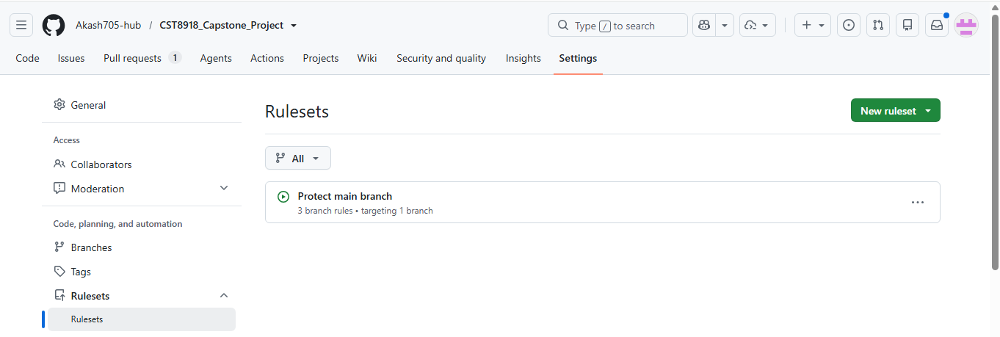

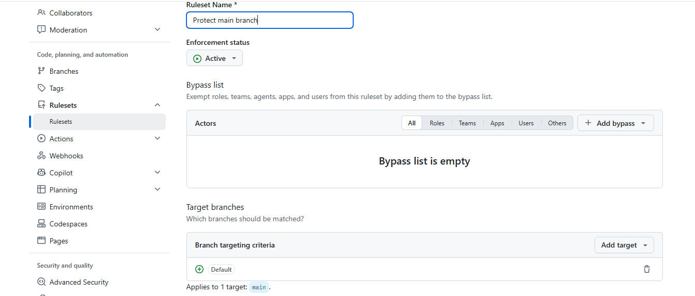

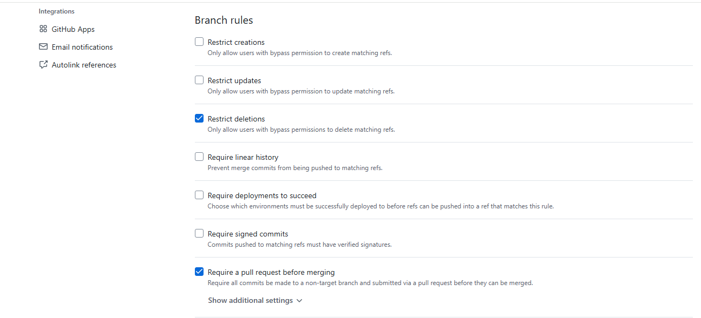

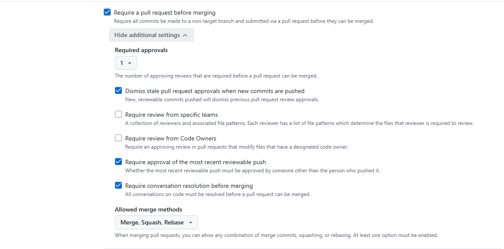

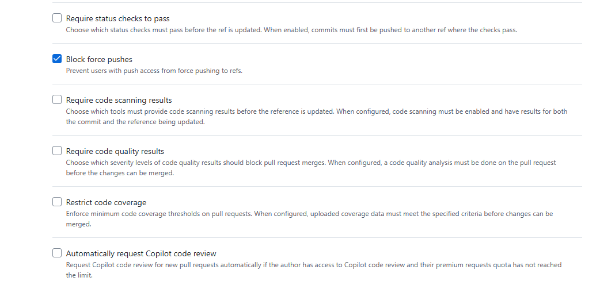

---

# Local Testing

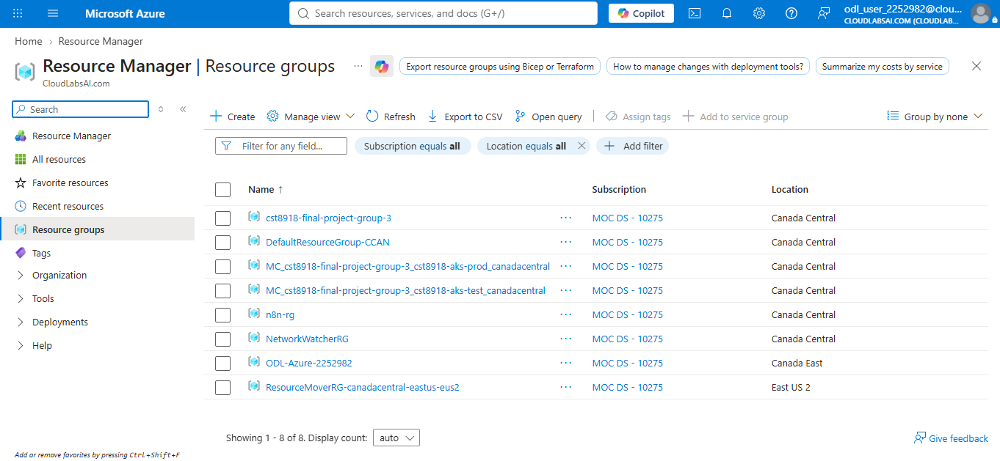

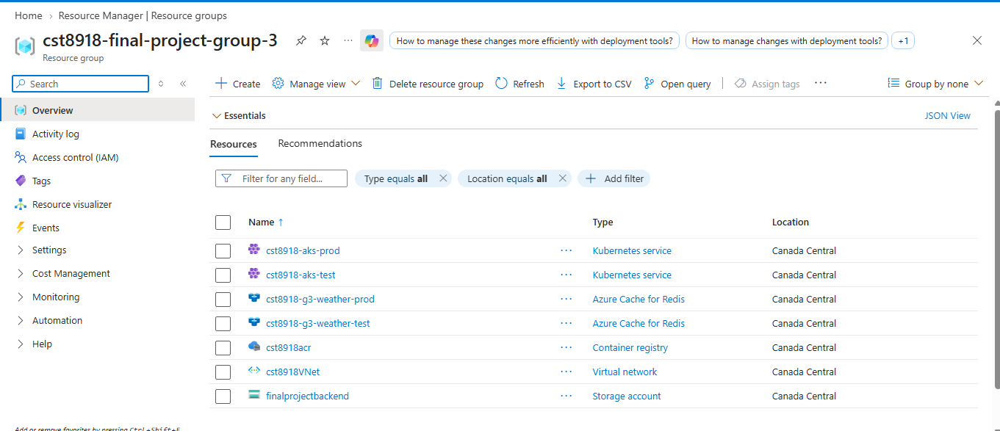

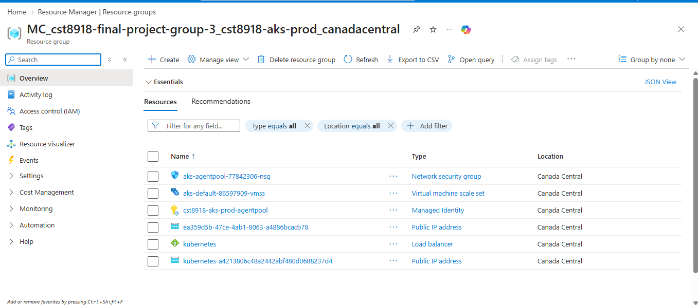

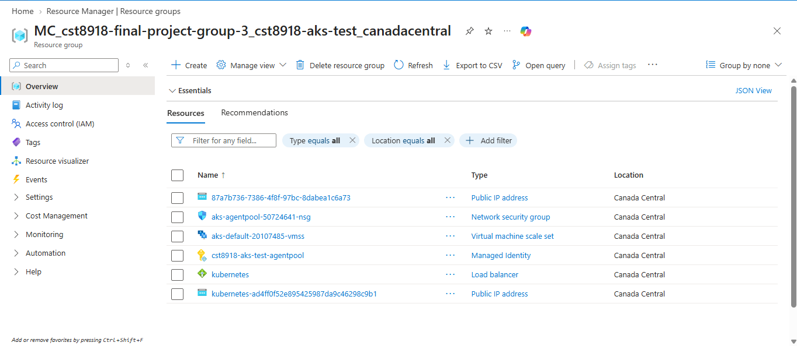

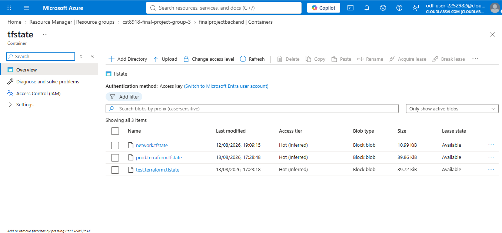

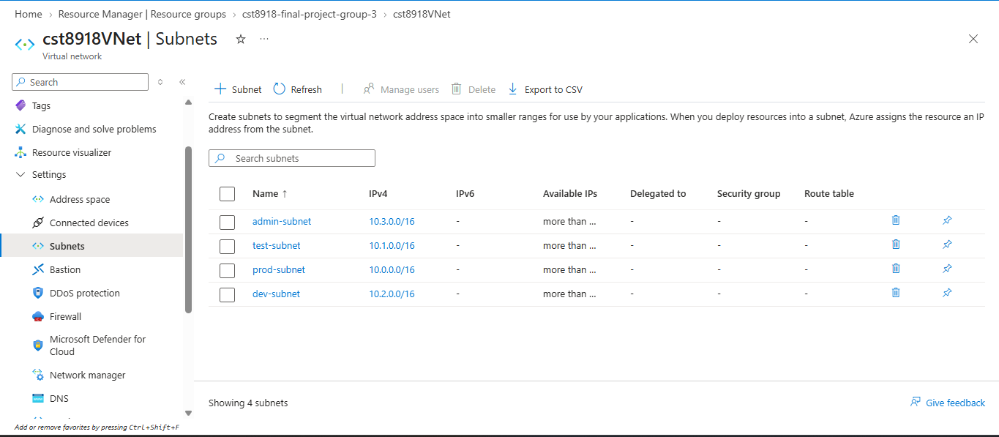

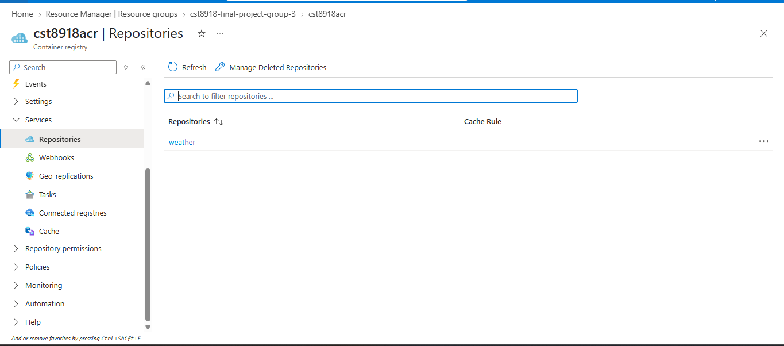

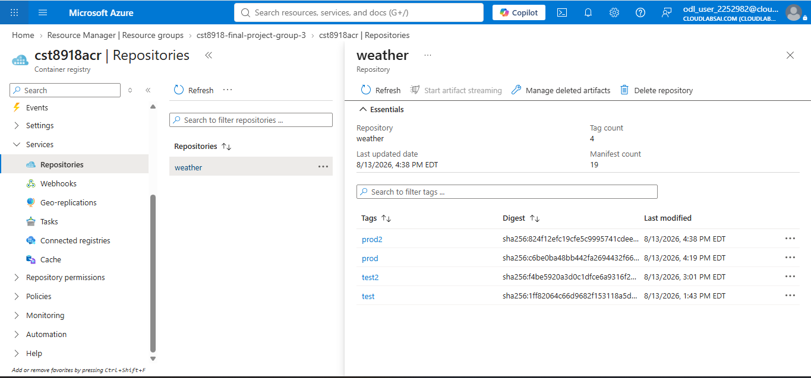


---

# GitHub Actions

The following GitHub Actions workflows are included or will be implemented during the project:

- Terraform Static Analysis
- Terraform Plan
- Terraform Apply
- Docker Image Build
- Kubernetes Deployment

A screenshot of the completed GitHub Actions workflows will be added before the final submission.

---

# Getting Started

Clone the repository:

```bash
git clone https://github.com/Akash705-hub/CST8918_Capstone_Project.git
```

Initialize Terraform:

```bash
terraform init
```

Format Terraform files:

```bash
terraform fmt
```

Validate the configuration:

```bash
terraform validate
```

Generate an execution plan:

```bash
terraform plan
```

Deploy the infrastructure:

```bash
terraform apply
```

> **Note:** Azure authentication is required before deploying any infrastructure.

---

# Special Instructions

- Use Terraform modules located under `infra/modules`.
- Each environment (`dev`, `test`, and `prod`) should use its own Terraform configuration.
- Store the Terraform state remotely in Azure Blob Storage after the bootstrap infrastructure has been created.
- GitHub Actions will automate validation, planning, deployment, Docker image creation, and Kubernetes deployment.

---

# GitHub Actions Screenshot

> *(To be added before final submission.)*

---

# Course Information

**Course:** CST8918 – DevOps: Infrastructure as Code

**Professor:** Robert McKenney
